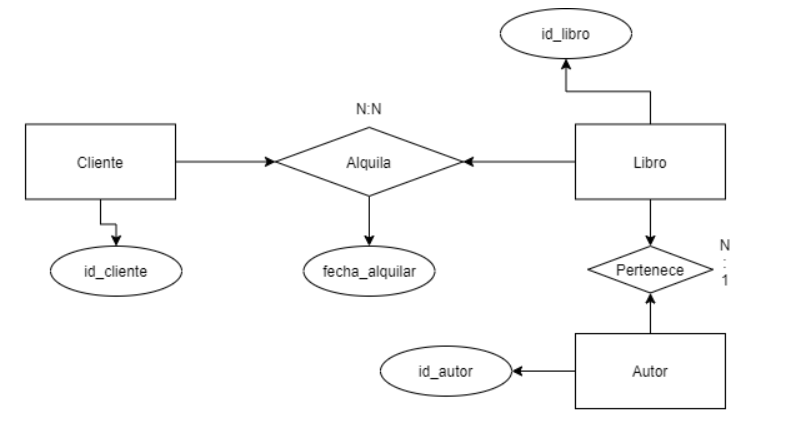
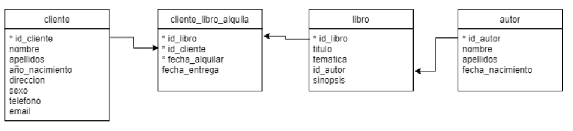

# 1. Introducción

## Índice

[1. Definición y características](#1-definición-y-características)  
[2. Instalación](#2-instalación)  
[3. Fundamentos de bases de datos relacionales](#3-fundamentos-de-bases-de-datos-relacionales)

## 1. Definición y características

- SQL es un lenguaje de consultas estándar.
- Trabaja con bases de datos (BD) relacionales.
- Es interpretado por sistemas gestores de BD (SGBD).
- Es un lenguaje estructurado y no procedimental.

## 2. Instalación

Para desarrollar bases de datos relacionales (BDR) con SQL se necesita instalar un editor para escribir las consultas y un servidor de BD que varía en función del SGBD con el que se haya decidido trabajar.

En caso de que sea Microsoft SQL Server (en Windows), se necesitan los siguientes requisitos:

- [SQL Server](https://www.microsoft.com/es-es/sql-server/sql-server-downloads)
- [SQL Server Management Studio](https://learn.microsoft.com/es-es/sql/ssms/download-sql-server-management-studio-ssms?view=sql-server-ver16)

## 3. Fundamentos de bases de datos relacionales

### Definición y conceptos básicos

Una **base de datos** es un conjunto exhaustivo no redundante de **datos estructurados**, organizados independientemente de su utilización y su **implementación en máquina**, accesibles en **tiempo real** y **compartibles por usuarios concurrentes** que tienen necesidad de **información** diferente y no predecible en el **tiempo**.

En el caso de las BDR, la información se estructura en **tablas**, es decir, por **filas** (también llamadas **registros**) y **columnas** (también llamadas **campos**), donde cada fila expresa todos los datos de una observación y cada columna un **tipo de dato** concreto que todas las observaciones tienen cada una con su **valor** correspondiente.

Cada registro se identifica unívocamente del resto mediante una **clave primaria** que actúa como identificador único (no repetido) y no vacío. Los datos de las tablas a su vez se **relacionan** entre sí mediante estas claves, de manera que las filas pueden tener una columna que guarda la **clave foránea** que coincide en valor con la primaria de la otra tabla relacionada.

### Modelo relacional

- Modelo entidad-relación (lógico):

  

- Modelo relacional (físico):

  

### Otros tipos de bases de datos

- Orientadas a objetos
- Orientadas a documentos

## Referencias

[Modelo relacional](https://es.wikipedia.org/wiki/Modelo_relacional)  
[Fundamentos de las bases de datos relacionales](https://datamanagement.es/2020/03/30/fundamentos-de-las-bases-de-datos-relacionales-para-data-science-y-dummies/)  
[Bases de datos relacionales: el modelo de datos en detalle](https://www.ionos.es/digitalguide/hosting/cuestiones-tecnicas/bases-de-datos-relacionales/)