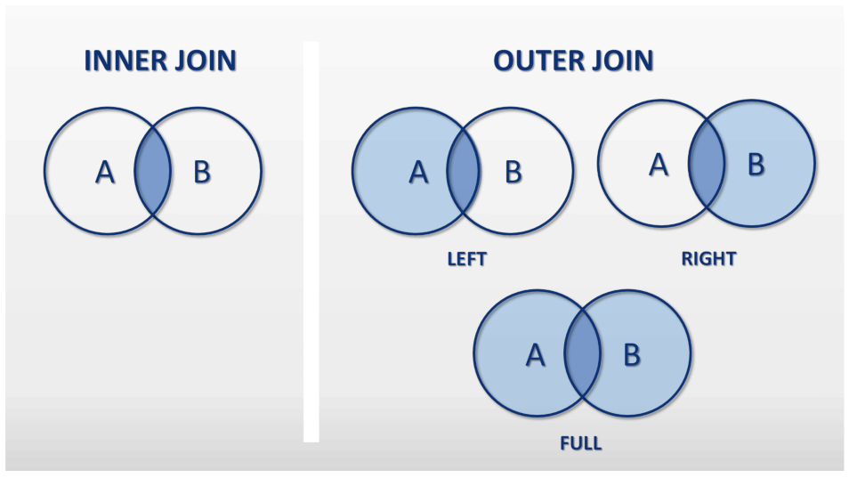

# 4. Lenguaje de consulta de datos

## Índice

[1. Selección monotabla](#1-selección-monotabla)  
[2. Selección multitabla](#2-selección-multitabla)  
[3. Agregación y grupos](#3-agregación-y-grupos)  
[4. Subconsultas](#4-subconsultas)  
[5. Unión](#5-unión)

## 1. Selección monotabla

Para todos los campos:

    SELECT *
      FROM books;

Proyectando por algún campo:

    SELECT name
      FROM books;

Obteniendo no repetidos:

    SELECT DISTINCT name
      FROM books;

Ordenando:

    SELECT name
      FROM books
      ORDER BY name;

Limitando a los 2 primeros:

    SELECT TOP(2) name
      FROM books
      ORDER BY name;

Contando:

    SELECT COUNT(*)
      FROM books;

## 2. Selección multitabla

Tomando campos de dos tablas relacionadas:

- INNER JOIN

      SELECT b.title AS Titulo, a.name AS Autor
        FROM books b JOIN authors a
          ON b.idAuthor = a.id;

- LEFT OUTER JOIN

      SELECT b.title AS Titulo, a.name AS Autor
        FROM books b LEFT JOIN authors a
          ON b.idAuthor = a.id;

- FULL OUTER JOIN

      SELECT b.title AS Titulo, a.name AS Autor
        FROM books b LEFT JOIN authors a
          ON b.idAuthor = a.id;

## 3. Agregación y grupos

Para agrupar los datos de una consulta según uno o varios campos indicando una condición para el grupo:

    SELECT idAuthor, COUNT(*)
      FROM books
      GROUP BY idAuthor
      HAVING COUNT(*) > 1;

Las funciones de agrupación disponibles en SQL son: `COUNT`, `SUM`, `MAX`, `MIN` y `AVG`.

## 4. Subconsultas

Lo que devuelve una subconsulta es un conjunto de datos de una única columna (generalmente una clave primaria) que proporciona a la superconsulta para que esta compruebe si sus datos están contenidos dentro del conjunto de aquella:

    SELECT title
      FROM books
      WHERE idAuthor IN (
        SELECT id
          FROM authors
          WHERE name LIKE 'M%'
      );

## 5. Unión

Para devolver la unión de dos consultas:

    SELECT NULL, title
      FROM books
      WHERE idAuthor IS NULL;
    UNION
    SELECT a.name, b.title
      FROM books b JOIN authors a
        ON b.idAuthor = a.id
      WHERE b.idAuthor IS NOT NULL
      ORDER BY a.name, b.title;

## Referencias

[Select](https://www.w3schools.com/sql/sql_select.asp)  
[Distinct](https://www.w3schools.com/sql/sql_distinct.asp)  
[Where](https://www.w3schools.com/sql/sql_where.asp)  
[Order by](https://www.w3schools.com/sql/sql_orderby.asp)  
[Top](https://www.w3schools.com/sql/sql_top.asp)  
[Joins](https://www.w3schools.com/sql/sql_join.asp)  
[Group by](https://www.w3schools.com/sql/sql_groupby.asp)  
[Having](https://www.w3schools.com/sql/sql_having.asp)  
[Union](https://www.w3schools.com/sql/sql_union.asp)